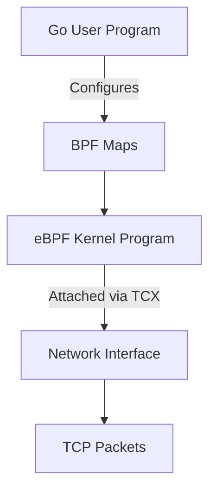

# eBPF Port and Process Filter


This project provides Go programs to load eBPF filters for controlling TCP traffic.
It supports two main use cases:

1. **Block all outgoing TCP traffic to a specified port**
2. **Restrict a specific process so it can only use one allowed TCP port**

The implementation uses the [Cilium eBPF Go library](https://github.com/cilium/ebpf) and attaches programs to network interfaces via the TCX hook.

---

## Overview

The project consists of:

- **eBPF C programs**
    - `port_block.c`: Drops TCP packets with a configurable destination port.
    - `filter_by_proc.c`: Allows only TCP traffic on a specific port for a process identified by PID.

- **Go programs**
    - `apps/pktblocker/main.go`: Loads and configures the port blocking filter.
    - `apps/procfilter/main.go`: Loads and configures the process-port filter.

The Go programs update BPF maps for runtime control:

- `config_map`: blocked TCP port.
- `allowed_port_map`: allowed TCP port for a process.
- `target_pid_map`: PID of the monitored process.

---

## Directory Structure

```
apps/
  pktblocker/
    main.go
    pktblocker/
    port_block_bpfeb.go
    port_block_bpfeb.o
    port_block_bpfel.go
    port_block_bpfel.o
  procfilter/
    filter_by_proc_bpfeb.go
    filter_by_proc_bpfeb.o
    filter_by_proc_bpfel.go
    filter_by_proc_bpfel.o
    main.go
    procfilter/
go.mod
go.sum
PROJECT.md
run_test.sh
source/
  ebpfprog/
    filter_by_proc.c
    port_block.c
```

---

## Requirements

- Linux kernel **5.15+** with eBPF and TCX support
- **Go 1.19+**
- **Clang** and **LLVM** (for compiling eBPF C code)
- `bpf2go` tool from [Cilium eBPF](https://github.com/cilium/ebpf)
- **Root privileges** to run the programs

#### Install `bpf2go`:

```bash
go install github.com/cilium/ebpf/cmd/bpf2go@latest
```

---

## Building

Compile eBPF programs and build the Go binaries.

**Port Blocking Program**
```bash
cd apps/pktblocker
go generate
go build -o portblock main.go
```

**Process Filter Program**
```bash
cd apps/procfilter
go generate
go build -o procfilter main.go
```

---

## Usage

### Block a Port

Attach the filter to a network interface and block a port:

```bash
sudo ./portblock <interface> <port>
```

**Example:**
```bash
sudo ./portblock eth0 8080
```
Blocks all outgoing TCP traffic to port 8080 on interface `eth0`.

### Restrict a Process to a Port

Attach the filter to an interface, specify a process name, and allow only one port:

```bash
sudo ./procfilter <interface> <process_name> <port>
```

**Example:**
```bash
sudo ./procfilter eth0 myprocess 4040
```
Allows only TCP traffic on port 4040 for process `myprocess` on interface `eth0`.
Traffic from that process on other ports is dropped.

---

## Architecture



---

## Limitations

- **Filters only egress traffic.** Ingress traffic is not affected.
- **Process selection by name:** If multiple processes share the same name, only the first PID from `pgrep` is used.
- **Experimental:** Not intended for production use.

---

## License

- eBPF C programs are licensed under **GPL**.
- Go code is provided as example software.

---